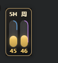

# Codex Quota Pet Widget

一个贴在 Codex 原生宠物旁边的小小额度牌。它不碰 Codex 本体，不抢鼠标，也不弹窗，只乖乖缩在宠物旁边，把 `5H` 和 `周` 额度变成两根小柱子。想看额度时瞄一眼就行，少点一次菜单，多留一点脑子给正事。



## 复制给 Agent 一键安装

把下面这段话复制给 Codex、ChatGPT Agent 或其他本地开发 Agent，它就能帮你下载、安装并启动：

```text
请帮我安装并启动 Codex Quota Pet Widget：
1. 确认我的电脑已经安装 Node.js 和 npm。
2. 克隆仓库：https://github.com/Dogegegee/codex-quota-pet-widget.git
3. 进入项目目录，运行 npm install。
4. 运行 npm run build。
5. 如果我是 Windows，请双击或执行“启动额度挂件.cmd”；如果我是 macOS，请先执行 chmod +x ./启动额度挂件.command，然后双击或执行“启动额度挂件.command”。
6. 启动后告诉我：需要先在 Codex 里打开原生宠物，挂件才会贴到宠物旁边；退出挂件可以在挂件上右键选择“退出额度挂件”。
```

给用户的说明：复制上面整段提示词给你的 Agent，它会按步骤完成安装、构建和启动。你只需要先确保电脑上有 Node.js。

## 当前效果

- 左侧是 `5H` 额度，右侧是 `周` 额度。
- 竖向柱子的高度表示当前剩余额度百分比。
- 额度颜色表示风险：
  - 绿色：剩余额度充足
  - 黄色：额度进入观察区
  - 红色：额度偏低，挂件外框会轻微闪烁
- 每根额度柱外沿有一圈细环：
  - 蓝色环对应 `5H` 额度周期
  - 紫色环对应 `周` 额度周期
  - 环从顶部开始，按当前窗口已经走过的时间环绕一周
- 右键挂件可以退出，不占用主界面空间。

## 数据来源

挂件优先读取当前用户目录下的 Codex 本地日志数据库：

```text
Windows: %USERPROFILE%\.codex\logs_2.sqlite
macOS/Linux: $HOME/.codex/logs_2.sqlite
```

它会查询 Codex websocket 日志里的 `codex.rate_limits` 事件，并读取：

- `primary`：视为 5 小时额度窗口
- `secondary`：视为 1 周额度窗口

显示值为：

```text
剩余额度 = 100 - used_percent
```

如果 SQLite 查询不可用，挂件会尝试读取 `logs_2.sqlite-wal` 中最近的 websocket 额度事件；再不行才回退到 `sessions` / `archived_sessions` 里的 JSONL 会话日志。

## 刷新机制

挂件默认每 5 秒刷新一次，并监听 Codex session 日志变化。

Codex 有时在 5 小时额度恢复时不会立刻写入新的 `rate_limits` 事件。为避免挂件一直停在低额度或 0 额度，项目会根据 `reset_at` 和 `window_minutes` 做一个本地估算：

- 当前时间还没到 `reset_at`：显示日志中的真实剩余额度。
- 当前时间已经超过 `reset_at`，但还没有新日志：先按新窗口估算为 `100%`。
- 下一个 reset 时间会按窗口长度顺延，例如 5 小时窗口会顺延 5 小时。

这个估算只用于解决日志延迟，不会写入 Codex，也不会影响真实额度。

## 快速开始

先在 Codex 里打开原生宠物，然后按你的系统启动。

首次安装依赖：

```bash
npm install
npm run build
```

Windows：

```powershell
.\启动额度挂件.cmd
```

也可以直接双击 `启动额度挂件.cmd`。

macOS：

```bash
chmod +x ./启动额度挂件.command
./启动额度挂件.command
```

也可以给 `启动额度挂件.command` 授权后双击打开。

手动启动：

```bash
npm start
```

开发模式：

```bash
npm run dev
npm run dev:electron
```

## 退出挂件

在挂件上右键，选择 `退出额度挂件`。

如果挂件没有显示，请先确认 Codex 原生宠物已经打开。挂件会自动读取宠物位置，并贴到宠物旁边。

## 安全边界

- 不修改 Codex 安装目录。
- 不修改 `app.asar`。
- 不写入 Codex 内部状态。
- 只读取 Codex 宠物位置、本地额度日志和会话日志。
- 自己的日志写入当前用户的 `.codex/quota-pet-widget` 目录。

## 测试

```bash
npm test
```

当前测试覆盖：

- 额度百分比归一化
- 5 小时 / 1 周窗口映射
- 周期进度计算
- reset 后本地估算恢复
- SQLite 日志优先读取
- 避免从 SQLite 主库文本残留里读到旧额度
- WAL 和 session 日志回退
- Codex 原生宠物位置解析
- 挂件贴靠定位
- 一键启动脚本和 README 关键说明
